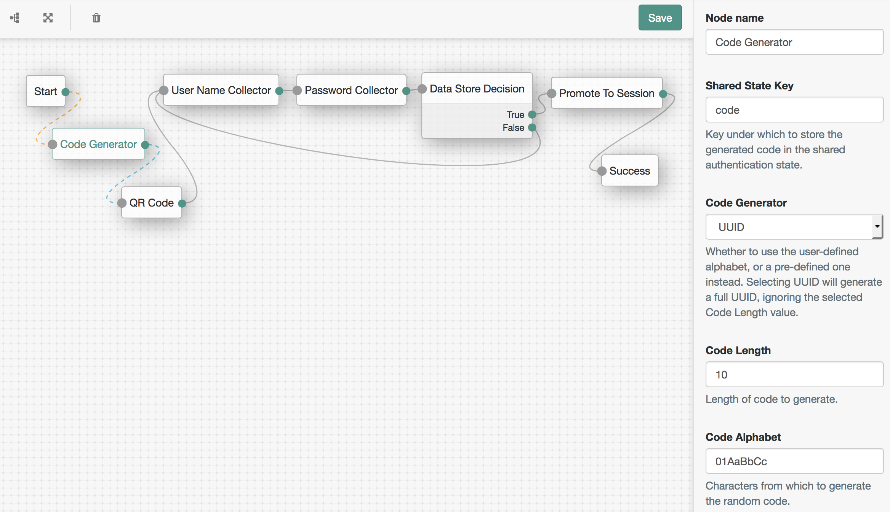

<!--
 * The contents of this file are subject to the terms of the Common Development and
 * Distribution License (the License). You may not use this file except in compliance with the
 * License.
 *
 * You can obtain a copy of the License at legal/CDDLv1.0.txt. See the License for the
 * specific language governing permission and limitations under the License.
 *
 * When distributing Covered Software, include this CDDL Header Notice in each file and include
 * the License file at legal/CDDLv1.0.txt. If applicable, add the following below the CDDL
 * Header, with the fields enclosed by brackets [] replaced by your own identifying
 * information: "Portions copyright [year] [name of copyright owner]".
 *
 * Copyright 2017 ForgeRock AS.
 * Portions copyright 2018 David Luna.
-->
# Code Generator Node

A simple authentication node for ForgeRock's [Identity Platform][forgerock_platform] 5.5 and above. This node will generate randomized codes according to a selected output length and **code generator** and store them in the shared authenticating session state under a provided key as a String.

The various supported **code generators** are:

- **CodeAlphabet** User-defined alphabet - use the **Code Alphabet** field to enter the chosen alphabet characters. Repeating characters will increase the likelihood of their being chosen.
- **UUID** Universally unique identifier. Selecting this will ignore the value of the **Code Length** field to produce a 36 character [UUID](https://en.wikipedia.org/wiki/Universally_unique_identifier).
- **Alphanumeric** Upper-case English alphabet, lower-case English alphabet and digits 0 through 9.
- **DeviceCode** A ForgeRock-specific alphabet, used when generating OAuth2.0 DeviceCode flow codes. Similar to **Base58** but with certain characters that may look similar on low-resolution displays removed: *0, 1, U, u, 8, 9 l, O, I, V, v, B, and g*.
- **Base58** [Base58](https://en.wikipedia.org/wiki/Base58) 
- **Base64** [Base64](https://en.wikipedia.org/wiki/Base64)   
- **Base64Url** [Base64Url](https://en.wikipedia.org/wiki/Base64#Variants_summary_table)
- **Alphabet** English alphabet, in both upper and lower-case.
- **AlphabetUppercase** English alphabet, just upper-case.
- **AlphabetLowercase** English alphabet, just lower-case.
- **Decimal** Digits 0 through 9.
- **Hex** Hex digits: *0, 1, 2, 3, 4, 5, 6, 7, 8, 9, a, b, c, d, e, f*   
- **Binary** Binary digits: *0, 1*

Configuration Screenshot

The above screenshot demonstrates generating a random UUID, displaying it to the user via a QR code, authenticating the user and storing the generated code in their session properties.

## Installation

Copy the .jar file from the ../target directory into the ../web-container/webapps/openam/WEB-INF/lib directory where AM is deployed.  Restart the web container to pick up the new node.  The node will then appear in the authentication trees components palette.

## Disclaimer

The code in this repository has binary dependencies that live in the ForgeRock maven repository. Maven can be configured to authenticate to this repository by following the following [ForgeRock Knowledge Base Article](https://backstage.forgerock.com/knowledge/kb/article/a74096897).
        
The sample code described herein is provided on an "as is" basis, without warranty of any kind, to the fullest extent permitted by law. ForgeRock does not warrant or guarantee the individual success developers may have in implementing the sample code on their development platforms or in production configurations.

ForgeRock does not warrant, guarantee or make any representations regarding the use, results of use, accuracy, timeliness or completeness of any data or information relating to the sample code. ForgeRock disclaims all warranties, expressed or implied, and in particular, disclaims all warranties of merchantability, and warranties related to the code, or any service or software related thereto.

ForgeRock shall not be liable for any direct, indirect or consequential damages or costs of any type arising out of any action taken by you or others related to the sample code.

[forgerock_platform]: https://www.forgerock.com/platform/  
